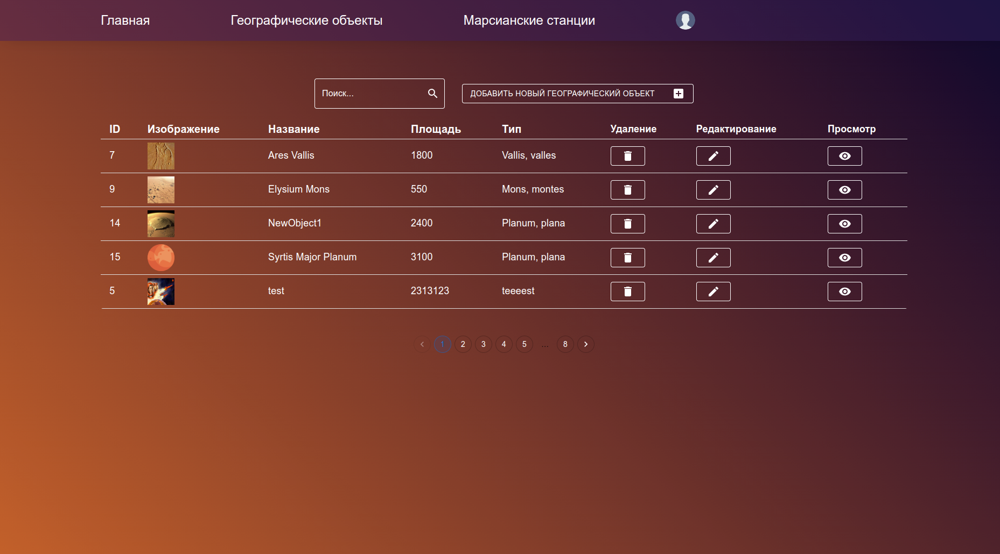
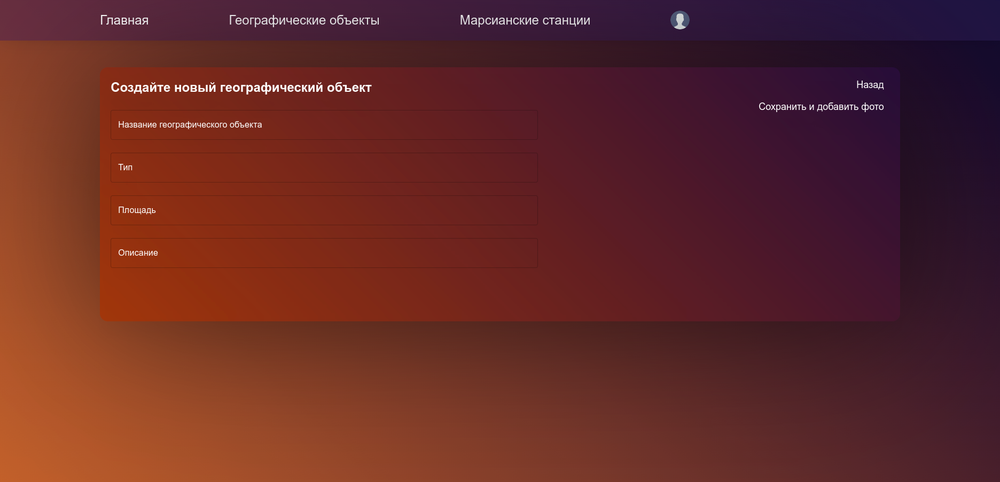
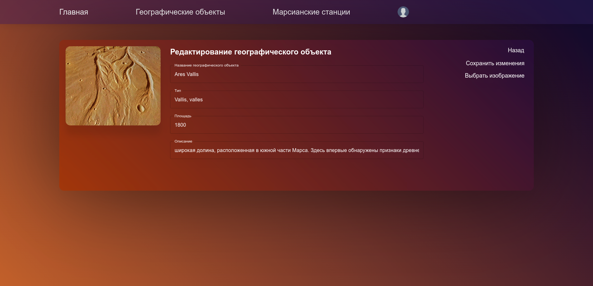

## Разработка Интернет Приложений

### Предметная область "Станции на поверхности Марса"

Описание домашней работы

- **Цель работы**: Закрепление полученный знаний
- **Порядок показа**: создать заявку в интерфейсе `пользователя`. Авторизоваться под `модератором`, одобрить `заявку` и отредактировать список `услуг`.
- **Отчет**: отчет необходимо отправить на почту [aikanev@bmstu.ru](). Оценивается раскрытие предметной области в описании и приложении, корректность оформления отчета.
- **Контрольные вопросы**: любые вопросы по реализации интерфейса `модератора`
- **Диаграммы**: диаграмма состояний для статусов `заявок` и диаграмма прецедентов. Актуализировать все диаграммы из лабораторных, все диаграммы должны соответствовать реализованной вами системе. Все диаграммы должны быть читаемые, шрифт на них должен не отличаться по размеру от шрифта текста отчета.
- **Задание**: Реализовать интерфейс `модератора` и подготовить итоговый отчет

Необходимо добавить в приложение React интерфейс `модератора`, доступный после его авторизации и имеющий следующие отличия:
- Новое окно редактирования `услуг`, список услуг отображается таблицей. Доступно добавление новых услуг (обязательные и необязательные поля), редактирование, удаление.
- В окне списка `заявок` доступны кнопки для смены статуса заявок. Также есть поля фильтрации по диапазону `даты формирования` и статусу заявок (через бэкенд) и пользователю (на фронтенде).
- Окно списка `заявок` переделать на `short polling` чтобы отображать актуальные статусы

**Отчет-РПЗ** по всем лабораторным и ДЗ:
1. **Введение** (актуальность, цель, назначение, нефункциональные требования, задачи)
2. **Бизнес-процесс**. Описание предметной области. Диаграмма прецедентов, диаграмма состояний и деятельности/BPMN (>300 слов)
3. **Архитектура**. Диаграммы развертывания, ER с назначением таблиц и диаграмма классов с детализацией бэкенда и фронтенда (>300 слов)
4. **Алгоритмы**. Диаграмма последовательности HTTP запросов (>300 слов)
5. **Описание интерфейса**. Перечень окон, их назначение и выполняемые пользователями действия (>300 слов)
6. **Заключение**. Перечень выполненных задач и достигнутые результаты. Ссылка на GitHub
7. **Список использованных источников**
8. **Приложение. Техническое задание**

Демонстрация

- Авторизация модератора

- Страницы таблицы заявки модератора

- Страница принятия\отказания заявки

- Страница таблицы географических объектов

- Страница добавления новой услуги

- Страница редактирования услуги

