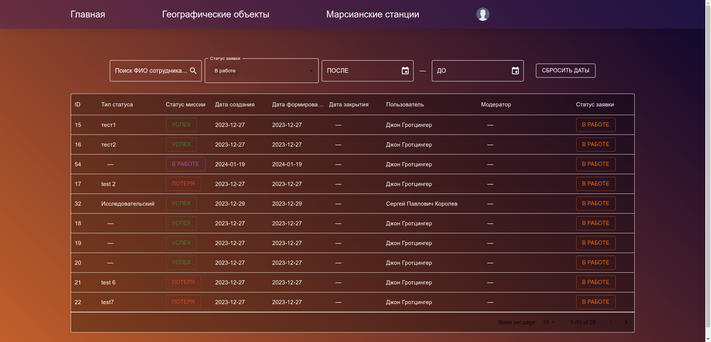

## Разработка Интернет Приложений

### Предметная область "Станции на поверхности Марса"

Описание лабораторной работы

- **Цель работы**: Завершение интерфейса `пользователя` в `React`
- **Порядок показа**: показать авторизацию, добавление и формирование `заявки`. Пояснить в коде использование `redux` и `axios`. Показать авторизацию в браузере, использовать содержимое `localStorage`/`cookie` чтобы показать заявки пользователя в `insomnia`/`postman`.
- **Контрольные вопросы**: схема redux, reducer, store, контекст, axios
- **Диаграмма классов** с детализацией бэкенда и фронтенда: добавить методы авторизации, фронтенд разделить на страницы, добавить у страниц зависимость от API.
- **Activity диаграмма/BPMN** для итогового бизнес-процесса для ДЗ: описание бизнес-процесса, разделение на дорожки по ролям двух пользователей и выделенного сервиса, действия соответствуют операциям пользователей в вашей системе.
- **Задание**: Добавить авторизацию и возможность оформления `заявок` во фронтенд через `Redux Toolkit`

Добавить страницы для регистрации и авторизации. Добавить окно для просмотра списка `заявок` пользователя в виде таблицы. Добавить в меню пункты для новых страниц. Для обращений к методам веб-сервиса использовать `axios`. При выполнении запросов отображать на странице анимацию.

Добавление менеджера состояний `Redux Toolkit` для хранения фильтров заявок и услуг, а также состояния интерфейса после авторизации. В приложении должно быть реализовано переключение между интерфейсом гостя и интерфейсом пользователя по кнопке `Вход`/`Выход`. После авторизации в меню должно отображаться Имя/Логин пользователя. При выходе должно сбрасываться содержимое конструктора новой заявки.

Добавление на странице услуг кнопки `Добавить` для внесения данной услуги в новую заявку. Добавление страницы `конструктора` заявки-черновика, где можно удалить уже добавленные в заявку услуги, поменять их количество или `подтвердить` заявку. Эта же страница используется для просмотра заявок в других статусах, но без возможности редактирования. Переход на страницу `конструктора` через специальную кнопку, которая меняет состояние, если заявка-черновик есть или ее нет.

* [Методические указания Redux Toolkit + fetch](/tutorials/redux/redux_toolkit.md)
* [Методические указания Redux Toolkit + кодогенерация и Axios](/tutorials/lab6/lab6_tutorial.md)

##### Дополнительное задание

Кодогенерация из `swagger` (+2 балла). Показать применение сгенерированного кода фронтенда из `swagger`.

Демонстрация

- Страница регистрации

- Страница авторизации

- Страница список услуги

- Страница заявки

- Страница выбора услуги и отображение кол-во выбранных услуг на корзине (значок ракета)

- Страница редактирования черновой заявки

- Страница после отправки

