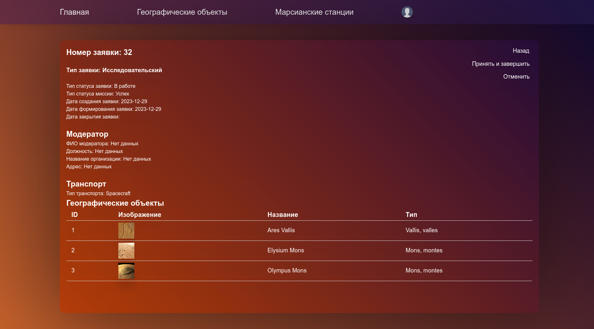

## Разработка Интернет Приложений

### Предметная область "Станции на поверхности Марса"

Описание лабораторной работы

- **Цель работы**: Разработка базового SPA на React
- **Порядок показа**: показать две страницы фронтенда в браузере из `localhost` с бэкендом, а в `GitHub Pages` с mock на телефоне, применить фильтрацию услуг. Внести изменения в БД, показать их во фронтенде. Объяснить код компонентов для фильтрации, передаваемые props, хуки, вызовы fetch.
- **Контрольные вопросы**: react, props, компонент, элемент, состояние, хуки, жизненный цикл компонента
- **Deployment диаграмма** все узлы и компоненты системы: фронтенда, web-сервера со статикой, веб-сервиса, базы данных и других хранилищ и тд. Узлы соединить протоколами, компоненты фронтенда и бэкенда поместить в узлах, указать API между ними.
- **Задание**: Разработать две страницы фронтенд приложения на `React`, `TS` и подключить его к веб-сервису. Подготовить ТЗ на итоговую систему.

Разработать базовый интерфейс приложения на `React` для `гостя`, аналогичный двум страницам из лабораторной работы №1 для просмотра `услуг`. При этом на странице списка `услуг` должны быть все необходимые фильтры (по диапазону дат, названию, цене) с фильтрацией на бэкенде. Использовать компоненты `React-Bootstrap`. Для карточек предусмотреть изображение по-умолчанию, если поле в `услуге` пустое. Необходимо развернуть фронтенд на `GitHub Pages`.

В приложении должны быть навигационная панель `navbar` для списка базовых страниц, а также самописная навигационная цепочка `breadcrumbs`, где отображается путь от базовой страницы к текущей. В этой лабораторной никакого `Redux`, а `Context` вообще в курсе использовать нельзя.

Содержимое карточек получать из веб-сервиса лабораторной №3. Ajax-запросы написать самостоятельно через `fetch`. Ограничение с `CORS` решить через проксирование `React`. В методах `fetch` предусмотреть получение данных из коллекции с `mock`-объектами при отсутствии доступа к вашему бэкенду.

* [Методические указания](/tutorials/lab4/lab4_tutorial.md)

**ТЗ** на итоговую систему (сплошная нумерация):
1. **цель**
2. **назначение** - краткое описание для чего, кто работает в системе
3. **задачи**
4. **методы веб-сервиса** таблицей с группировкой по доменам: метод, url, описание, входные, выходные данные
5. **Функциональные требования** - список окон и какие действия для каких групп пользователей доступны. Указать, какие методы бэкенда при этом вызываются. 8 страниц:

* гость: регистрация, аутентификация, список услуг, одна услуга

* создатель заявки: конструктор заявки, список заявок

* модератор: список услуг таблицей, редактирование/создание услуги

6. **требования к аппаратному** обеспечению для сервера и клиента
7. **требования к программному** обеспечению с версиями для серверных компонентов и для клиента

Демонстрация

- Главное меню

- Список географических объектов

- Данные о географическом объекте

- Список mock-географических объектов

- Данные о mock-географическом объекте

[Ссылка на GitHub Pages](https://redalexdad.github.io/MarsStationFrontend/)